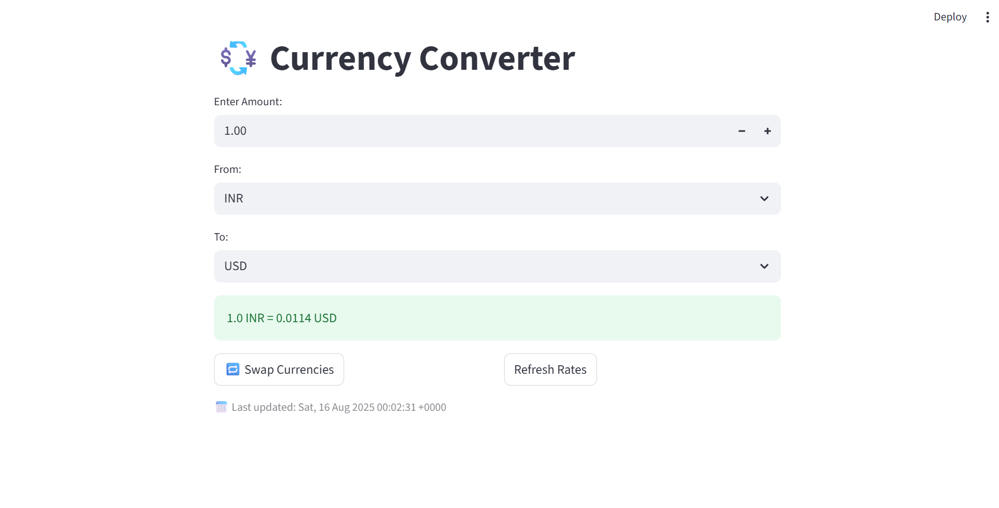

# Currency Converter App

A simple and interactive currency converter web application built with **Streamlit** that fetches real-time exchange rates from an open API.
---
## Features

- Fetches live currency exchange rates based on USD from [open.er-api.com](https://open.er-api.com/)
- Converts any amount from one currency to another
- Swap source and target currencies with one click
- Refresh exchange rates anytime to get the latest values
- Displays the last updated timestamp of the rates
---
## Demo

  
🚀 [Try Live App](https://currencyconverter-7rniaurf2d83scrumcbozb.streamlit.app)

---

## Installation

1. Clone this repository:
   ```bash
   git clone https://github.com/yourusername/currency-converter.git
   cd currency-converter
   ```

2. Create and activate a Python virtual environment (optional but recommended):
   ```bash
   python -m venv venv
   source venv/bin/activate  # On Windows: venv\Scripts\activate
   ```

3. Install the required packages:
   ```bash
   pip install streamlit requests
   ```

---

## Usage

1. Run the Streamlit app with:
   ```bash
   streamlit run cc_app.py
   ```

2. Enter the amount you want to convert.
3. Select the source currency ("From") and the target currency ("To").
4. Click **Swap Currencies** to switch the conversion direction.
5. Click **Refresh Rates** to update exchange rates from the API.
---
## Dependencies
- `streamlit`
- `requests`

Install them using:
```bash
pip install streamlit requests
```
---
## API Used
Exchange rates are fetched from the free API:

https://open.er-api.com/v6/latest/USD
---

## License
This project is open source and available under the [MIT License](LICENSE).
---

## Contact
For any questions or suggestions, feel free to open an issue or contact me at [dinesh85583@gmail.com].
